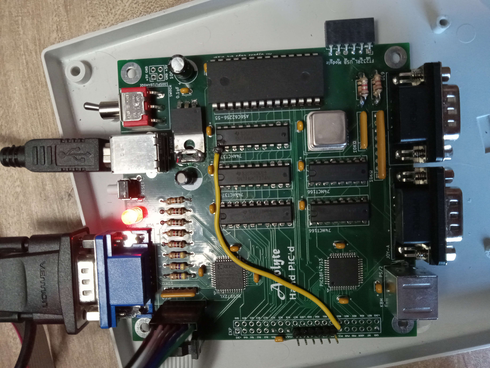
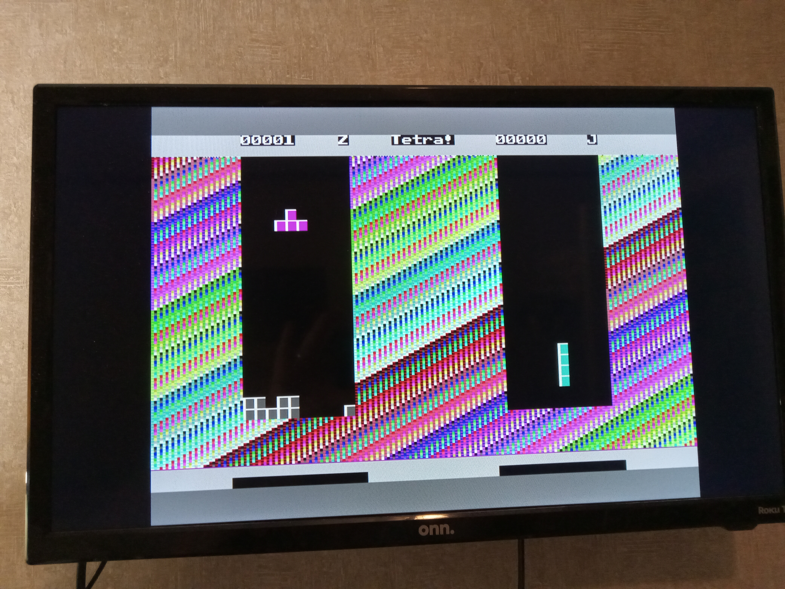

<b>Acolyte - Hand PIC'd</b>

This is a PIC-only version of the Acolyte computer.  The main two chips used are the PIC18F47J13 microcontroller and the XC9572XL CPLD.  It contains 32KB of video RAM and has two Sega Genesis controller ports.  The PIC runs off of a 40 MHz oscillator, yet the video is divided down to 5 MHz.  It displays 4 colors per row from 16 total colors, at a resolution of 400 x 256.  

The main reason for leaving the 6502 / 65816 microprocessor is that the PIC allows you to program in C.  Although I have become pretty good at programming in 6502 assembly, I prefer using C because it is 'my native language'.  The goal for this project is to make a fairly cheap, stand-alone computer that will play (multiplayer) video games.  I am already thinking of possible upgrades though!
